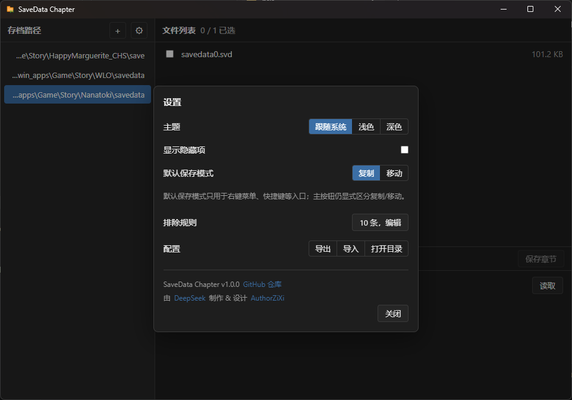

## 介绍

是不是在烦恼“怎么存档位不够啊？”

SaveData Chapter 是一个做管理存档和分章的工具（面向 Win 上的 VN 游戏），可以解决你的痛点。

## 为什么它会诞生

作为资深的存档狂魔，我过去开发了[USDCT](https://github.com/AuthorZiXi/UniversalSaveDataChapterTool)（本项目前身），但是那个工具还是有不少槽点的。

所以我重新设计了这个工具，让 DeepSeek 代劳了。

## 能做什么

- 注册多个存档目录，快速切换
- 文件列表勾选，保存为章节（复制或移动）
- 章节列表读取、删除、加备注（`meta.json`）
- 切换深浅色主题
- 文件列表自动刷新
- 路径失效后右键重新定位
- 删除进入回收站

## 有什么遗憾吗

部分引擎（如 Key 社的）不会在打开存档界面时重新读取文件，用"移动"模式会报找不到文件。

这种游戏请用"复制"模式。"复制"模式不会清空存档位，代价是游戏内保存时可能弹覆盖询问。

## 下载

从 [Releases](https://github.com/AuthorZiXi/savedata-chapter/releases) 下载

需要 Windows 10+ 与 WebView2

## 截图

---

开发相关见 [DEVELOPMENT.md](./DEVELOPMENT.md)